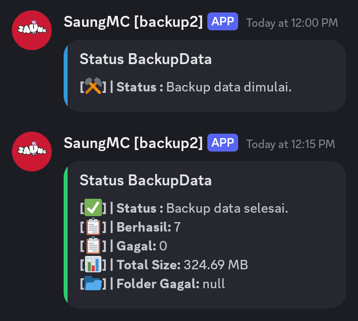

# AutoBackupData V1.7

AutoBackupData adalah skrip bash yang digunakan untuk melakukan backup folder dari server lokal ke Google Drive menggunakan [Rclone](https://rclone.org/). Selain itu, skrip ini juga mengirimkan notifikasi status backup ke Discord melalui webhook.

## Fitur:
- Backup folder ke Google Drive secara otomatis.
- Mendukung pilihan format backup: `.zip`, `.tar.gz`, atau `.tgz`.
- Mengirimkan notifikasi ke Discord dengan status backup.
- Dapat dijalankan secara otomatis menggunakan cron.

## Prasyarat:
- VPS/Server dengan akses root.
- Rclone terinstal dan dikonfigurasi.
- Webhook Discord (opsional, jika tidak diatur, notifikasi tidak akan dikirim).

## Panduan Instalasi

### 1. **Upload Skrip**
   Upload skrip `BackupData.sh` ke direktori root server/VPS Anda (atau direktori pilihan lain).

### 2. **Instalasi Dependensi**
   Instal dependensi yang dibutuhkan oleh skrip ini dengan menjalankan perintah berikut:
   ```bash
   sudo apt update && sudo apt install curl bc zip tar -y
   ```

### 3. **Install & Setup Rclone**
   Instal rclone menggunakan perintah berikut:
   ```bash
   curl https://rclone.org/install.sh | sudo bash
   ```

   Setelah itu, konfigurasikan rclone dengan menjalankan:
   ```bash
   rclone config
   ```

   Ikuti langkah-langkah konfigurasi yang ditunjukkan di layar untuk menghubungkan Google Drive Anda ke rclone.

### 4. **Ubah Konfigurasi Skrip**
   Buka file `BackupData.sh` menggunakan text editor (seperti `nano` atau `vim`) dan sesuaikan pengaturan berikut:
   
   - **`RCLONE_REMOTE_NAME`**: Nama remote rclone yang Anda konfigurasikan.
   - **`GDRIVE_DIR`**: Nama folder di Google Drive tempat backup akan disimpan.
   - **`WEBHOOK_URL`**: URL webhook Discord (jika diinginkan).
   - **`SIZE_FORMAT`**: Format ukuran (KB, MB, GB).
   - **`BACKUP_FORMAT`**: Format file backup (`zip`, `tar.gz`, atau `tgz`).
   - **`BASE_DIR`**: Direktori lokal yang akan dibackup.
   - **`EXCLUDE_FOLDERS`**: Daftar folder yang akan diabaikan selama proses backup.

### 5. **Beri Izin Eksekusi Skrip**
   Ubah izin file agar skrip dapat dieksekusi:
   ```bash
   chmod +x /root/BackupData.sh
   ```

### 6. **Jalankan Skrip**
   Untuk menjalankan skrip secara manual, ketik:
   ```bash
   bash /root/BackupData.sh
   ```

### 7. **Jalankan Skrip Secara Otomatis dengan Crontab**
   Untuk menjalankan skrip secara otomatis pada waktu tertentu, Anda bisa menggunakan cron. Tambahkan jadwal ke crontab dengan mengetik:
   ```bash
   crontab -e
   ```

   Lalu masukkan baris berikut untuk menjalankan skrip setiap hari pada pukul 00:00 dan 12:00:
   ```bash
   0 0,12 * * * bash /root/BackupData.sh
   ```

   Simpan dan tutup editor.

## Screenshot


```
